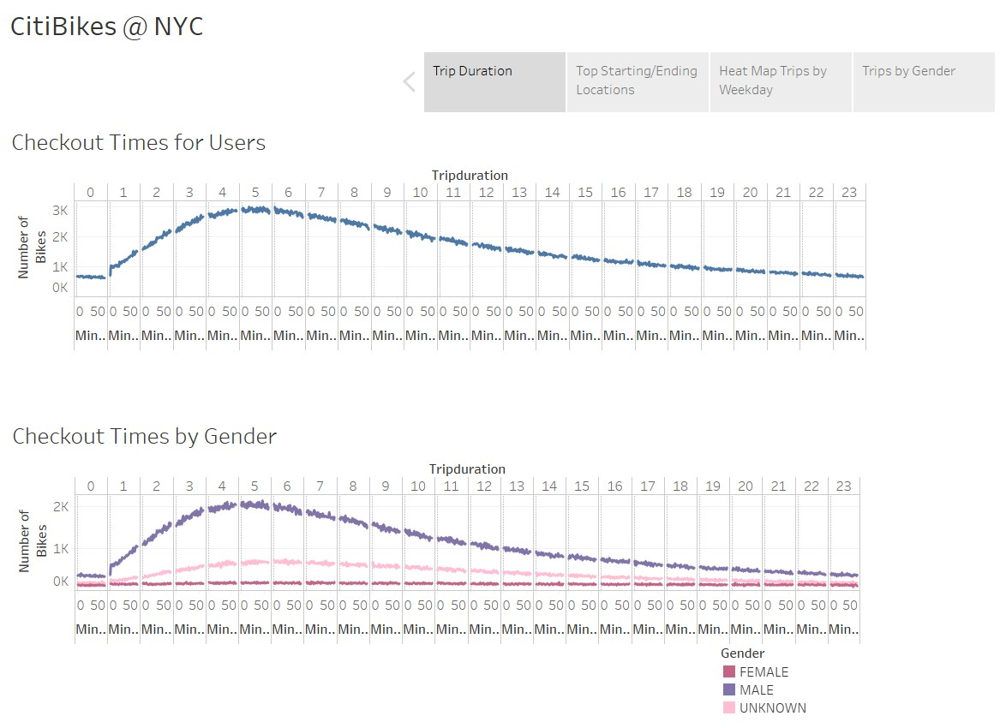
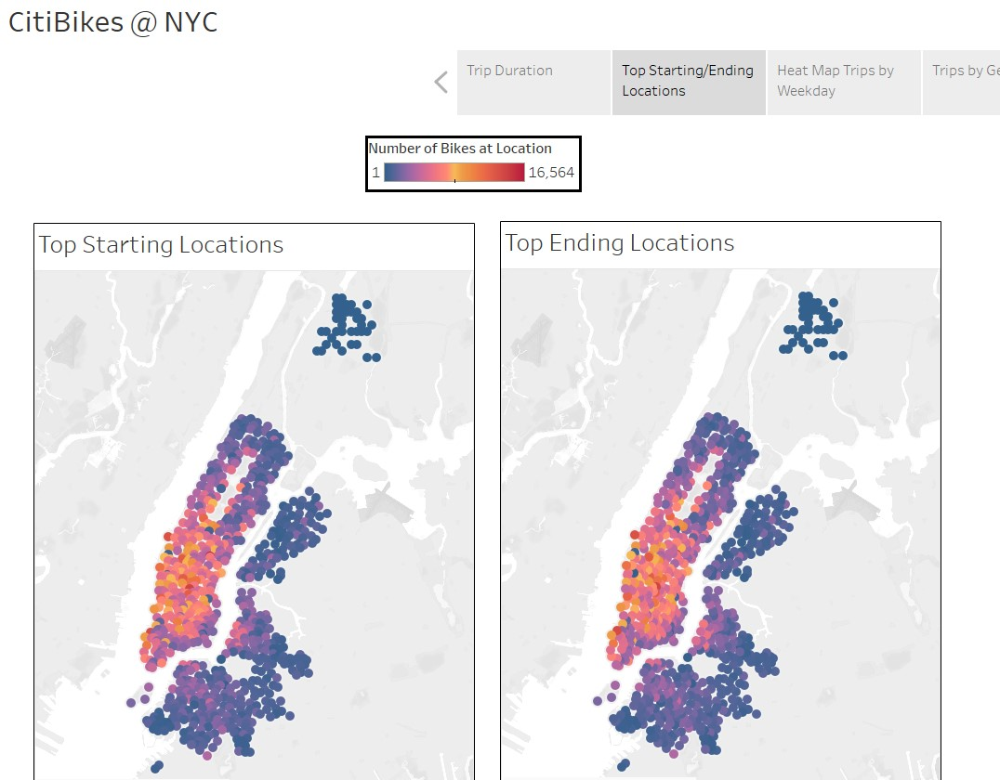
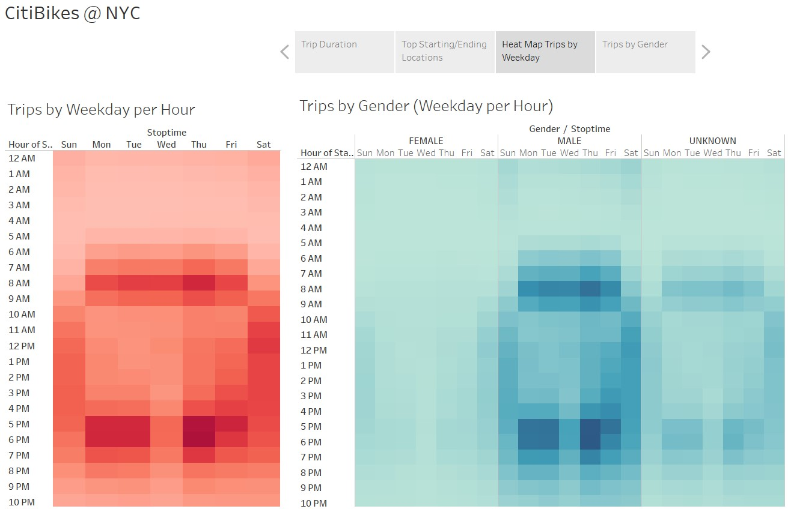
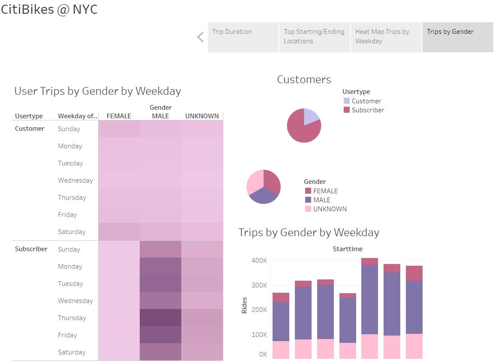

# Bikesharing

## Overview of the analysis:
The purpose of this analysis is to provide investors with a visual representation of the CitiBike program in New York City. This will be included as part of our proposal to start a similar bike sharing program in Des Moines, IA.  
## Results:
### Trip Duration
Duration of trips by overall users and broken down by gender. Trips are represented in minutes. The peak hours of trips are from 5-6pm.

### Starting and Ending Locations
Top starting and ending locations in NYC for bike trips. The size of the dots increases as the popularity of the pickup/drop-off increases. The color of the dots progresses from purple to red as the location increases in popularity. The red and orange dots make it easy to quickly identify to the most popular locations.
 
### Trip Duration by Weekday per Hour
Heat map representation of the trips by day and per hour. The first map provides an overview of all users. The second map provides a breakdown by gender. The darker colors represent higher numbers of riders and a particular day and time. 5-6 pm during weekdays seems to be the most popular for both maps. 

### Gender Visualization 
Various visual displays of the trips broken down by gender and customers vs subscribers. Males riders tend to dominate the trips regardless of the day of the week. 

## Summary 
From the analysis, we can conclude that males tend to utilize the bike sharing program at a higher frequency than women. Based on the peak time of day and days of the week of usage we can make an inference that the bikes are likely being used to commute from work. This information is useful when considering ideal locations in Des Moines for the bike sharing program. Two additional visualizations that I would perform with the given data set would be an analysis of the number of trips by subscribers vs customers by gender and subscriber vs customers by age. This information would be helpful in marketing strategies. 
## Tableau Public Link
[link to Tableau]( https://public.tableau.com/views/CitiBikesNYC_16112915134930/Story1?:language=en&:display_count=y&publish=yes&:origin=viz_share_link)

